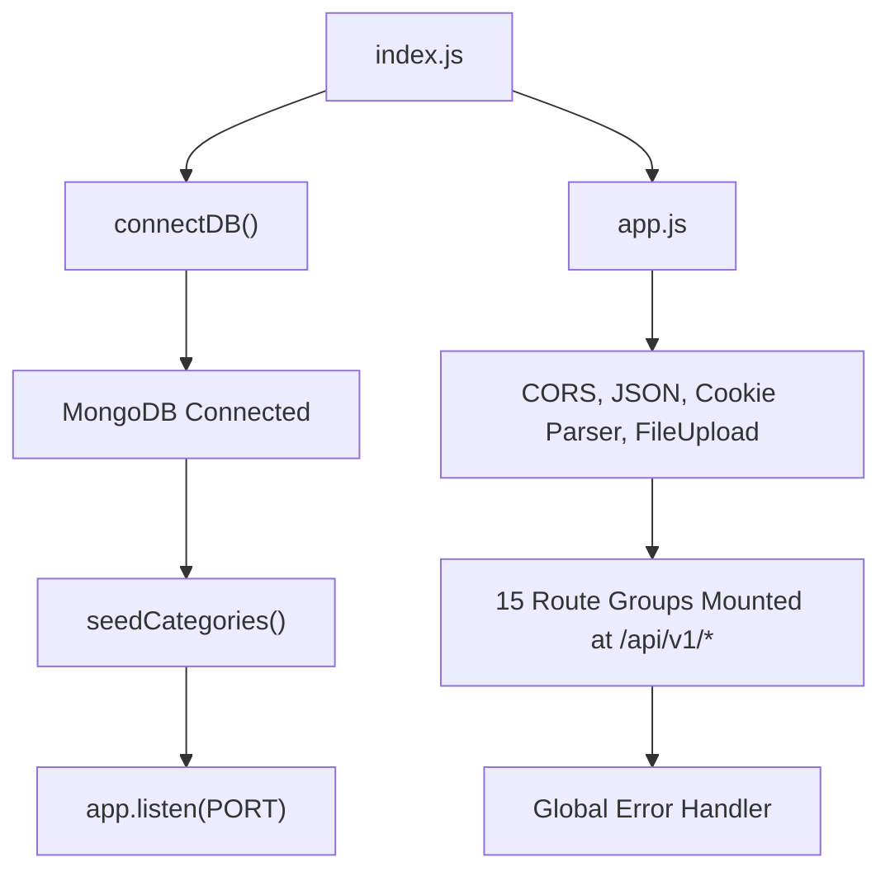
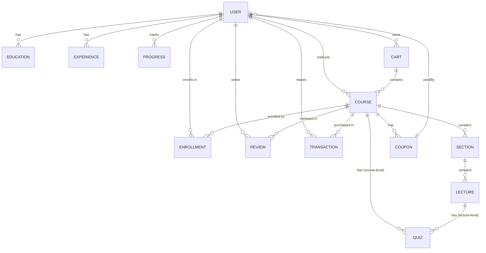
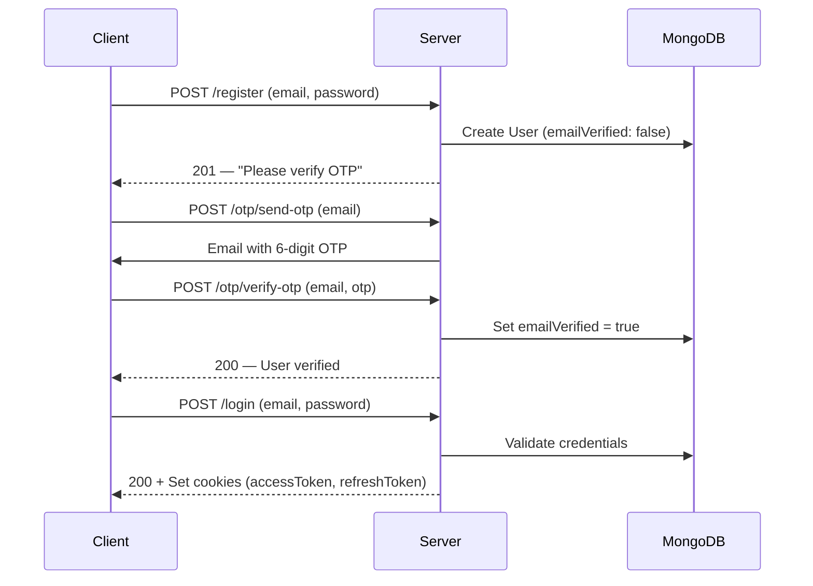

# Learnify Backend — Deep Dive Analysis

> **Last Updated:** 2026-04-23

---

## 1. Overview

Learnify is an **online learning platform** (like Udemy) built with:

| Layer         | Technology                                |
|---------------|-------------------------------------------|
| Runtime       | Node.js (ES Modules)                      |
| Framework     | Express.js v4                             |
| Database      | MongoDB via Mongoose v8                   |
| Auth          | JWT (access + refresh tokens) + Google OAuth 2.0 (Passport.js) |
| Payments      | Razorpay                                  |
| File Storage  | Cloudinary (images/videos) + AWS S3 (raw video uploads) |
| Video CDN     | AWS CloudFront (HLS streaming)            |
| Email         | Nodemailer (Gmail SMTP)                   |
| PDF           | PDFKit (course completion certificates)   |
| Dev Tools     | Nodemon, Prettier                         |

---

## 2. Project Structure

```
backend/
├── config/
│   └── passport.js              # Google OAuth strategy
├── src/
│   ├── index.js                 # Entry point — connects DB, starts server
│   ├── app.js                   # Express app setup, middleware, route mounting
│   ├── constants.js             # (empty — unused)
│   ├── Data/
│   │   └── categoryData.js      # Seed data for course categories
│   ├── db/
│   │   └── connection.js        # MongoDB connection + category seeding
│   ├── models/                  # 17 Mongoose models
│   ├── controllers/             # 15 controller files
│   ├── routes/                  # 15 route files
│   ├── middlewares/
│   │   ├── auth.middleware.js   # JWT verification + role authorization
│   │   └── errorHandler.js      # Global error handler
│   └── utils/
│       ├── ApiError.js          # Custom error class
│       ├── ApiResponse.js       # Standardized response wrapper
│       ├── asyncHandler.js      # Async error wrapper for controllers
│       ├── awsBucketConfig.js   # S3 presigned URL + folder deletion
│       ├── cloudinary.js        # Cloudinary upload + video duration
│       ├── sendEmail.js         # Nodemailer transporter
│       └── updateCoursePrice.js # Recalculates course finalPrice from coupons
├── .env / .env.sample
└── package.json
```

---

## 3. Application Bootstrap Flow



1. `index.js` calls `connectDB()` → connects to MongoDB
2. On success, seeds categories (if needed) and starts the Express server
3. `app.js` configures middleware and mounts all 15 route groups under `/api/v1`

---

## 4. Database Schema & Relationships

### 4.1 Entity-Relationship Diagram



### 4.2 Model Details

#### `User`
| Field | Type | Notes |
|-------|------|-------|
| `googleId` | String | Sparse unique — for OAuth users |
| `profilePicture` | `{ publicId, url }` | Cloudinary image |
| `name` | String | Required |
| `email` | String | Required, unique |
| `emailVerified` | Boolean | Default: `false` |
| `password` | String | Hashed via bcrypt (nullable for OAuth) |
| `bio` | String | |
| `role` | Enum: `student`, `instructor`, `admin` | Required |
| `coursesEnrolled` | Number | Counter (incremented on enrollment) |
| `refreshToken` | String | Stored JWT refresh token |
| `expertise` | [String] | Skills list |
| `education` | [ObjectId → Education] | |
| `experience` | [ObjectId → Experience] | |
| `socialLinks` | `{ linkedin, twitter, website, instagram, youtube }` | |

**Methods:** `isPasswordCorrect()`, `generateAccessToken()`, `generateRefreshToken()`
**Hooks:** Pre-save bcrypt hashing

---

#### `Course`
| Field | Type | Notes |
|-------|------|-------|
| `title`, `subtitle`, `description` | String | Required |
| `category`, `subcategory` | String | Required |
| `level` | Enum: `Beginner`, `Intermediate`, `Advanced`, `AllLevels` | |
| `price` | Number | Original price |
| `finalPrice` | Number | After best coupon discount |
| `instructor` | ObjectId → User | Required |
| `studentenrolled` | Number | Counter |
| `sections` | [ObjectId → Section] | |
| `averageRating` | Number | Recalculated on review add |
| `thumbnail` | `{ publicId, url }` | Cloudinary |
| `preview` | `{ publicId, url }` | Course preview video |
| `whatYouWillLearn` | [String] | |
| `courseIncludes` | [String] | |
| `certificateOption` | Enum: `direct`, `quiz` | |
| `quiz` | ObjectId → Quiz | Course-level quiz |
| `language` | String | Required |
| `published` | Boolean | Default: `false` |

---

#### `Section`
| Field | Type | Notes |
|-------|------|-------|
| `title` | String | Required |
| `courseId` | ObjectId → Course | Required |
| `lectures` | [ObjectId → Lecture] | |
| `duration` | Number | Sum of lecture durations |
| `order` | Number | Position in course |
| `published` | Boolean | Auto-managed based on lecture count |

---

#### `Lecture`
| Field | Type | Notes |
|-------|------|-------|
| `sectionId` | ObjectId → Section | Required |
| `quiz` | ObjectId → Quiz | Lecture-level quiz |
| `title` | String | Required |
| `videoFileName` | String | Original filename |
| `videoUrl` | String | CloudFront HLS URL |
| `duration` | Number | In seconds |
| `order` | Number | Position in section |
| `isFree` | Boolean | Default: `false` |

---

#### `Enrollment`
| Field | Type | Notes |
|-------|------|-------|
| `user` | ObjectId → User | Required |
| `course` | ObjectId → Course | Required |

Simple join table — no progress tracking here (separate `Progress` model).

---

#### `Progress`
| Field | Type | Notes |
|-------|------|-------|
| `userId` | ObjectId → User | |
| `courseId` | ObjectId → Course | |
| `completedLectures` | [ObjectId → Lecture] | |
| `progressPercentage` | Number | 0–100 |
| `courseCompleted` | Boolean | |
| `lastAccessed` | Date | |

---

#### `Quiz`
| Field | Type | Notes |
|-------|------|-------|
| `title` | String | |
| `lecture` | ObjectId → Lecture | null if course-level |
| `course` | ObjectId → Course | null if lecture-level |
| `questions` | [{ questionText, options[], correctAnswer }] | |
| `usersAttempted` | [ObjectId → User] | Tracks completion |
| `passingScore` | Number | Default: 50 |

---

#### `Review`
| Field | Type | Notes |
|-------|------|-------|
| `courseId` | ObjectId → Course | |
| `userId` | ObjectId → User | |
| `rating` | Number | 1–5 |
| `comment` | String | |

---

#### `Cart`
| Field | Type | Notes |
|-------|------|-------|
| `userId` | ObjectId → User | |
| `courses` | [ObjectId → Course] | |
| `totalAmount` | Number | Manually tracked |

---

#### `Coupon`
| Field | Type | Notes |
|-------|------|-------|
| `code` | String | Unique, uppercase, regex-validated |
| `discountPercentage` | Number | 1–100 |
| `expiresAt` | Date | |
| `status` | Enum: `active`, `inactive` | |
| `usedBy` | [ObjectId → User] | |
| `courseId` | ObjectId → Course | Per-course coupon |

---

#### `Transaction`
| Field | Type | Notes |
|-------|------|-------|
| `userId` | ObjectId → User | |
| `courses` | [ObjectId → Course] | Supports multi-course purchase |
| `instructorId` | ObjectId → User | |
| `razorpay` | `{ orderId, paymentId, signature }` | |
| `amount` | Number | |
| `currency` | String | Default: `INR` |
| `discountCode` | String | |
| `status` | Enum: `success`, `pending`, `failed`, `refunded` | |
| `paymentMethod` | String | |
| `courseAccessGranted` | Boolean | |

---

#### `Media`
| Field | Type | Notes |
|-------|------|-------|
| `thumbnail` | `{ publicId, url }` | |
| `video` | `{ publicId, url, duration }` | |
| `profilepic` | `{ publicId, url }` | |

Generic media storage — used for Cloudinary uploads.

---

#### `Otp`
| Field | Type | Notes |
|-------|------|-------|
| `email` | String | |
| `otp` | String | 6-digit code |
| `createdAt` | Date | TTL: 120 seconds (comment says 5 min, code says 2 min) |

---

#### `PasswordResetToken`
| Field | Type | Notes |
|-------|------|-------|
| `email` | String | |
| `token` | String | 32-byte hex token |
| `createdAt` | Date | TTL: 600 seconds (10 minutes) |

---

#### `Education`
| Field | Type | Notes |
|-------|------|-------|
| `user` | ObjectId → User | |
| `degree`, `institution` | String | |
| `startYear`, `endYear` | Number | |
| `cgpa` | Number | |

---

#### `Experience`
| Field | Type | Notes |
|-------|------|-------|
| `user` | ObjectId → User | |
| `jobTitle`, `company` | String | |
| `startYear` | Number | |
| `endYear` | Number | Optional |
| `description` | String | Optional |

---

#### `Category`
| Field | Type | Notes |
|-------|------|-------|
| `name`, `slug` | String | |
| `subcategories` | [{ name, slug, topics: [String] }] | Seeded on startup |

---

## 5. Authentication & Authorization

### Authentication Flow


### Token Strategy
- **Access Token:** JWT containing `{ _id, email, role }` — short-lived
- **Refresh Token:** JWT containing `{ _id }` — long-lived, stored in DB
- Tokens sent via HTTP-only cookies + response body

### Role-Based Authorization
- `verifyJWT` — Extracts and validates access token, attaches `req.user`
- `isAuthorized(...roles)` — Checks if `req.user.role` is in the allowed roles

---

## 6. API Endpoints

### 6.1 User Routes — `/api/v1/user`

| Method | Endpoint | Auth | Role | Description |
|--------|----------|------|------|-------------|
| POST | `/register` | ❌ | — | Register new user |
| POST | `/login` | ❌ | — | Login with email/password |
| GET | `/logout` | ✅ | — | Logout (clear tokens) |
| GET | `/getuser` | ✅ | — | Get current user profile |
| POST | `/refresh-token` | ❌ | — | Refresh access token |
| PUT | `/switch-user-role` | ✅ | — | Switch between student/instructor |
| POST | `/update-profile` | ✅ | — | Update name, bio, picture, socials |
| GET | `/auth/google` | ❌ | — | Initiate Google OAuth |
| GET | `/auth/google/callback` | ❌ | — | Google OAuth callback |
| POST | `/add-education` | ✅ | — | Add education entry |
| POST | `/update-education/:educationId` | ✅ | — | Update education |
| DELETE | `/delete-education/:educationId` | ✅ | — | Delete education |
| GET | `/get-education` | ✅ | — | Get user's education list |
| POST | `/add-experience` | ✅ | — | Add experience entry |
| POST | `/update-experience/:experienceId` | ✅ | — | Update experience |
| DELETE | `/delete-experience/:experienceId` | ✅ | — | Delete experience |
| GET | `/get-experience` | ✅ | — | Get user's experience list |
| POST | `/add-expertise` | ✅ | — | Add expertise/skill |
| DELETE | `/delete-expertise` | ✅ | — | Delete expertise (via query) |
| GET | `/get-expertise` | ✅ | — | Get user's expertise list |
| GET | `/get-instructor-stats/:instructorId` | ❌ | — | Get instructor course & student counts |
| GET | `/get-instructor-rating-and-reviews/:instructorId` | ❌ | — | Get instructor avg rating & review count |

---

### 6.2 Course Routes — `/api/v1/course`

| Method | Endpoint | Auth | Role | Description |
|--------|----------|------|------|-------------|
| POST | `/Add-course` | ✅ | instructor | Create a new course |
| POST | `/Add-lecture/:courseId` | ✅ | instructor | Add lecture to course (legacy) |
| GET | `/inst-courses` | ✅ | instructor | Get instructor's courses |
| POST | `/enrolle/:courseId` | ✅ | student | Enroll in course (legacy) |
| GET | `/stu-courses` | ✅ | student | Get student's enrolled courses |
| GET | `/all-courses` | ❌ | — | Get all courses |
| GET | `/fetchcourse/:courseId` | ❌ | — | Get single course details |
| GET | `/lectures/:courseId` | ✅ | — | Get course lectures |
| PATCH | `/change-publish-status/:courseId` | ✅ | instructor | Toggle publish status |
| PATCH | `/update-course/:courseId` | ✅ | instructor | Update course details |
| GET | `/recommend/:courseId` | ❌ | — | Get recommended courses |
| GET | `/course-search` | ❌ | — | Search courses (title, rating, price, language) |
| POST | `/complete-quiz` | ✅ | student | Mark quiz as completed |

---

### 6.3 Section Routes — `/api/v1/section`

| Method | Endpoint | Auth | Role | Description |
|--------|----------|------|------|-------------|
| POST | `/add-section` | ✅ | instructor | Create section in a course |
| GET | `/get-section-by-course/:courseId` | ❌ | — | Get sections with lectures |
| DELETE | `/delete-section/:sectionId` | ✅ | instructor | Delete empty section |
| PATCH | `/update-section/:sectionId` | ✅ | instructor | Update section title |

---

### 6.4 Lecture Routes — `/api/v1/lecture`

| Method | Endpoint | Auth | Role | Description |
|--------|----------|------|------|-------------|
| POST | `/add-lecture` | ✅ | instructor | Create lecture in a section |
| GET | `/get-lecture-by-section/:sectionId` | ✅ | — | Get lectures by section |
| GET | `/get-lecture/:lectureId` | ✅ | — | Get single lecture |
| PATCH | `/update-lecture/:lectureId` | ✅ | instructor | Update lecture title |
| DELETE | `/delete-lecture` | ✅ | instructor | Delete lecture (via query params) |
| POST | `/add-video-lecture` | ✅ | instructor | Attach video metadata to lecture |
| POST | `/upload-signed-aws-url` | ✅ | — | Get S3 presigned upload URL |
| DELETE | `/delete-video` | ✅ | instructor | Delete video from S3 |

---

### 6.5 Enrollment Routes — `/api/v1/enrollment`

| Method | Endpoint | Auth | Role | Description |
|--------|----------|------|------|-------------|
| GET | `/get-course-enrollment/:courseId` | ✅ | — | Get enrollment count for course |
| GET | `/get-user-enrollment/:userId` | ✅ | — | Get enrolled course count for user |
| GET | `/check-user-enrollment/:userId/:courseId` | ✅ | — | Check if user is enrolled |
| GET | `/get-enrolled-courses/:userId` | ✅ | — | Get all enrolled courses with details |

---

### 6.6 Progress Routes — `/api/v1/progress`

| Method | Endpoint | Auth | Role | Description |
|--------|----------|------|------|-------------|
| POST | `/update-progress` | ✅ | — | Update progress (auto-complete at 90% watch) |
| GET | `/get-progress/:userId/:courseId` | ✅ | — | Get progress for course |
| GET | `/get-certificate/:userId/:courseId` | ✅ | — | Download completion certificate (PDF) |
| POST | `/complete` | ✅ | — | Manually mark lecture as complete |
| POST | `/uncomplete` | ✅ | — | Unmark lecture completion |

---

### 6.7 Quiz Routes — `/api/v1/quiz`

| Method | Endpoint | Auth | Role | Description |
|--------|----------|------|------|-------------|
| POST | `/create-quiz` | ✅ | instructor | Create quiz (lecture or course level) |
| DELETE | `/delete-quiz/:quizId` | ✅ | instructor | Delete quiz |
| GET | `/get-all-quiz/:Id` | ✅ | — | Get quizzes for lecture/course |
| GET | `/get-quiz/:quizId` | ✅ | — | Get single quiz |
| GET | `/has-completed-quiz` | ✅ | — | Check if user completed quiz |

---

### 6.8 Cart Routes — `/api/v1/cart`

| Method | Endpoint | Auth | Role | Description |
|--------|----------|------|------|-------------|
| POST | `/add-cart` | ✅ | — | Add course to cart |
| GET | `/get-cart/:userId` | ✅ | — | Get user's cart |
| GET | `/remove-from-cart/:userId/:courseId` | ✅ | — | Remove course from cart |

---

### 6.9 Transaction Routes — `/api/v1/transaction`

| Method | Endpoint | Auth | Role | Description |
|--------|----------|------|------|-------------|
| POST | `/create-order` | ✅ | — | Create Razorpay order |
| POST | `/verify-payment` | ✅ | — | Verify payment + enroll (single/cart) |
| GET | `/get-user-instructor-transactions/:instructorId` | ✅ | — | Get instructor's transactions |
| GET | `/get-course-transactions/:courseId` | ✅ | — | Get transactions for course |
| GET | `/get-order-history` | ✅ | — | Get user's order history |

---

### 6.10 Coupon Routes — `/api/v1/coupon`

| Method | Endpoint | Auth | Role | Description |
|--------|----------|------|------|-------------|
| POST | `/create-coupon` | ✅ | instructor | Create coupon for course |
| GET | `/validate-coupon` | ✅ | instructor | Validate coupon code |
| GET | `/get-coupon/:courseId` | ✅ | instructor | Get coupons for course |
| DELETE | `/delete-coupon/:couponId` | ✅ | instructor | Delete coupon |
| PATCH | `/toggle-coupon/:couponId` | ✅ | instructor | Toggle active/inactive |

---

### 6.11 Review Routes — `/api/v1/review`

| Method | Endpoint | Auth | Role | Description |
|--------|----------|------|------|-------------|
| POST | `/add-review` | ✅ | — | Add review to course |
| GET | `/get-review/:courseId` | ❌ | — | Get reviews for course |
| DELETE | `/delete-review` | ✅ | — | Delete own review |

---

### 6.12 Media Routes — `/api/v1/media`

| Method | Endpoint | Auth | Role | Description |
|--------|----------|------|------|-------------|
| POST | `/upload-media` | ✅ | — | Upload media to Cloudinary |

---

### 6.13 OTP Routes — `/api/v1/otp`

| Method | Endpoint | Auth | Role | Description |
|--------|----------|------|------|-------------|
| POST | `/send-otp` | ❌ | — | Send OTP to email |
| POST | `/verify-otp` | ❌ | — | Verify OTP and mark email verified |

---

### 6.14 Password Reset Routes — `/api/v1/password-reset-request`

| Method | Endpoint | Auth | Role | Description |
|--------|----------|------|------|-------------|
| POST | `/password-reset-token` | ❌ | — | Request password reset email |
| POST | `/password-reset` | ❌ | — | Reset password with token |

---

### 6.15 Category Routes — `/api/v1/category`

| Method | Endpoint | Auth | Role | Description |
|--------|----------|------|------|-------------|
| GET | `/get-categories` | ❌ | — | Get all categories |

---

## 7. Key Business Logic

### Payment Flow (Razorpay)
1. Client calls `POST /create-order` with amount → Razorpay order created
2. Client completes payment on frontend with Razorpay SDK
3. Client calls `POST /verify-payment` with Razorpay signature
4. Server verifies HMAC signature
5. Supports **single** and **cart** purchase types
6. Creates `Transaction`, creates `Enrollment` for each course, clears cart

### Video Upload Flow (AWS S3 + CloudFront)
1. Frontend calls `POST /upload-signed-aws-url` → gets presigned S3 URL
2. Frontend uploads raw video directly to S3
3. (External) Lambda/pipeline transcodes to HLS
4. Frontend calls `POST /add-video-lecture` with metadata
5. Lecture `videoUrl` points to CloudFront HLS endpoint

### Course Pricing with Coupons
- When coupons are created/deleted/toggled, `updateCourseFinalPrice()` recalculates `finalPrice` using the best active, non-expired coupon discount

### Certificate Generation
- PDFKit generates a simple A4 landscape certificate
- Downloaded directly via `GET /get-certificate/:userId/:courseId`
